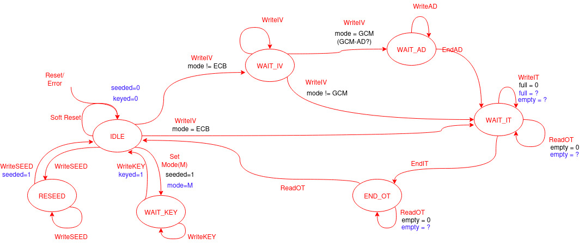

# Goals:
- add Tilelink support (TL-UL) for SMAesH operation
- wrap mode of operation around SMAesH core (ECB, CBC, CTR, GCM)

# Top-level architecture 

The top level FSM is displayed next, where the specific branching condition are depicted in black and status registers update in blue. 

 

 

Once reset, the core reaches an IDLE state in which he wait for configuration/execution procedure to start. At the completion of every procedure, after a reset (either hard or soft) or if an error occurs, the core reaches back the IDLE state. 

## Allowed Actions and Execution Flow

The different actions enabled by the core are detailed next. For each, we try to provide error/blocking conditions, how to proceed once initiated as well as information related to the input data potentially expected.   

- `Reset`:
    - description: Reset the core. 
    - effect(s): 
        - Reset the registers `seeded` and `keyed`
        - Flush the key internally configured in SMAesH Core (SC).
        - branch to `IDLE` state. 
    - error condition: None (always succeeds).
    - blocking condition: None (always expire). 
    - input data: physical PIN, sync active-LOW reset. 
- `SoftReset`:
    - description: Software controlled reset. 
    - effects(s): see `Reset`.
    - error condition: None.
    - blocking condition: None. 
- `WriteSEED`:
    - description: Send a payload of key for an ongoing seed configuration, or initiates one with fresh data. 
    - effects(s): 
        - From `IDLE`, process the payload and branch to `RESEED` to initiate a re-seeding procedure. 
        - From `RESEED`, process the payload of the ongoing re-seeding procedure. If last seed payload, branches to `IDLE` and set flag `seeded=1`. 
    - error conditions:
        - received from a state other than `IDLE` and `RESEED`. 
    - blocking condition:
        - SC is busy (could be constrained to the last transaction of a new seed)
    - input data: payload of 32-bits, containing 1/2/4 valid bytes, encoded in little endian. In particular, the following encoding are allowed:
        - considering `payload = 0xb3b2b1b0` such that `payload[i] = (payload >> 8*i) & 0xff`
        - if 1 byte is valid, only `i = 0` is valid,
        - if 2 bytes are valid, `i` in `[0, 1]` is valid,
        - if 4 bytes are valid, `i` in `[0, 1, 2, 3]` is valid. 
        - payloads longer than 4 bytes are encoded in multiple 32-bits words, and the sequential data words are accumulated at the byte granularity following the little endian encoding (i.e., from the first byte to the 4-th byte of each of the first word to the last one). 

- `SetMode`:
    - description: configure the core's execution by specifying the mode, the operation (encryption or decryption) and key size. The following possibilities are supported:
        - mode: ECB, CBC, CTR, GCM.
        - operation: encryption, decryption
        - key size: 128 , 192 or 256 bits.
        Together with the mode configuration, every `SetMode` command initiates the configuration of a new key value. 
    - effects(s):
        - From `IDLE`, process the payload, configure the status `mode` and branches to `WAIT_KEY` to initiate the configuration of a new key value.
    - error conditions: 
        - received from a state other that `IDLE`.
        - received if `seeded=0` (meaning that the core need to be seeded first). 
    - blocking condition:
        - SC is busy.
    - input data: configuration payload as a 32-bit word, such that
        `cfg[0:31]`: | 0   1 |  2 | 3     23 | 24   31 |
                    | KSIZE | OP | reserved | MODE    |

        where the following encodings are possible
            - `KSIZE` (`cfg[1:0]`):
                - `b'00`: 128-bit key,
                - `b'01`: 192-bit key,
                - `b'10`: 256-bit key,
            - `OP` (`cfg[2]`):
                - `0`: Encryption,
                - `1`: Decryption,
            - `MODE` (`cfg[31:24]`):
                - `0x00`: ECB,
                - `0x01`: CBC,
                - `0x02`: CTR,
                - `0x03`: GCM
- `WriteKEY`:
    - description: Send a payload of key for an ongoing key configuration.
    - effect(s):
        - process the payload for the ongoing key configuration. If last payload, branches to `IDLE` and set flag `keyed=1`.
    - error condition:
        - received from a state other that `WAIT_KEY`.
    - blocking condition:
        - None
    - input data: see `WriteSEED`.
- `WriteIV`:
    - description: For other mode than ECB, send a payload of Initialization vector (or counter) for an ongoing initialization configuration, or initiates one with fresh data. 
    - effects(s): 
        - From `IDLE`, process the payload and branch to `WAIT_IV` to initiate the initialization procedure. 
        - From `WAIT_IV`: 
            - accumulate the payload of the ongoing initialization procedure. 
            - If last payload: 
                - if `mode=GCM`:
                    - derive Counter0. 
                    - compute E_k(Counter0) for tag computation and store it.
                    - increment Counter0 for IT processing 
                    - reset tag value. 
                    - branches to `WAIT_AD`
                - if `mode!=GCM`:
                    - store the IV
                    - branch to `WAIT_IT` for other modes. 
    - error condition: 
        - received from a state other than `IDLE` or `WAIT_IV`
        - received if `mode=ECB`
    - blocking condition:
        - SC is busy (could be constrained to the last transaction of a new IV). Implementation details: the result of E_k(Counter0) used for tag generation is computed prior to AD/IT processing. 
    - input data: see `WriteSEED`. The following considerations apply depending on the mode configured:
        - The full payload size is 12 bytes for GCM mode (96-bit IV, as per NIST SP800-d 5.2.1.1)
        - The full payload size is 16 bytes for CBC/CTR mode (128-bit IV). 
- `WriteAD`: 
    - description: For GCM, send a payload of AD for the ongoing AD processing.
    - effects(s):
        - process the AD payload. 
        - If 16 bytes of payload accumulated, update tag value by computing the intermediated GHASH result. 
    - error condition:
        - received from a state other that `WAIT_AD`. 
    - blocking condition: 
        - SC is busy (typically, still processing the IV payload).
        - GHASH is still computing AD block previously received. 
    - input data: see `WriteSEED`. 
- `EndAD`: 
    - description: End the AD processing. 
    - effect(s):
        - v = len_bits(AD) % 128
        - update tag value by computing GHASH(lAD|0^128) where lAD is the last accumulated block of AD:
            - if v==0, process two blocks, the last (full) block of AD, and a block full of 0
            - if v>0, process the last black of AD, made of the last block of AD padded with 0 to reach block size.
        - branches to `WAIT_IT`
    - error condition:
        - received from a state other than `WAIT_AD`
    - blocking condition(s):
        - GHASH is still computing AD block previously received. 
    - input data: None
- `WriteIT`:
    - description: send a payload of input text for processing. 
    - effect(s):
        - process the IT payload.
        - update the status `full`
        - if 16 bytes of payload accumulated and `full=0` (`full=0` means that input buffer not full) 
            - process the accumulated block to compute the corresponding ciphertext/plaintext. 
            - if `mode=GCM`:
                - update tag value by computing GHASH(runner|lIT) where lIT is the last accumulated block of input text and runner is the temporary tag:
    - error condition: 
        - received from a state other than `WAIT_IT`
        - if `full!=0`
    - blocking condition(s):
        - SC busy
        - if `mode=GCM`, if GHASH is busy.
- `ReadOT`:
    - description: read a block of output text. 
    - effect(s): 
        - Read a 32-bit of output text payload. 
        - update status `empty` (`empty=1` meaning that the output buffer is empty)
        - if state is `END_OT` and last payload processed (meaning next `empty` is not `0`) branch to `IDLE`.
            
    - error condition:
        - received from a state other than `WAIT_IT` or `END_OT`
        - if `empty!=0`
    - blocking condition(s):
        - None
- `EndIT`:
    - description: End the processing of input text. 
    - effect(s): 
        - if `mode=GCM`:
            - u = len_bits(IT) % 128
            - update tag value by computing GHASH(lIT|0^128|len(AD)|len(IT)) where lIT is the last accumulated block of input text:
                - if u==0, process two blocks, the last (full) block of IT, and a block full of 0
                - if u>0, process the last black of IT, made of the last block of AD padded with 0 to reach block size.
            - release tag (i.e., queue it to the output buffer) or verify it (update internal status for reading). 
        - branch to `END_OT`
            
## DMA mapping and permission

- `Busy` (R): the core is currently processing and may result in a blocking access. 
- `Seeded` (R): the core is seeded, i.e., value of `seeded`
- `Keyed` (R): the core is readed, i.e., value of `keyed`
- `Mode` (R/W): 
    - read: read the current value configured. 
    - write: configure a new mode. 
- `InFree` (R): depicts the status of the input buffer. Either acts as a flag specifying the emptiness of the buffer, or is a value representing the place remaining in the input buffer. 
- `OutAwait` (R): depicts the status of the output buffer. Either acts as a flag specifying the fullness of the buffer, or is a value depicting the amount of read operation that can be performed.
- `DecError` (R/W):
    - read: status of the last decryption tag verification. 
    - write: reset the flag
- `StateChange` (W): generic command for state switch, i.e., `EndAD`, `EndIT` and `SoftReset`. 
- `Seed` (W): to write seed material, associated to `WriteSEED`.
- `Key` (W): to write key material, associated to `WriteKEY`,
- `IV` (W): to write IV material, associated to `WriteIV`,
- `InData` (W): to write input text, associated to `WriteIT`,
- `OutData` (R): to read output text, associated to `ReadOT`

 

